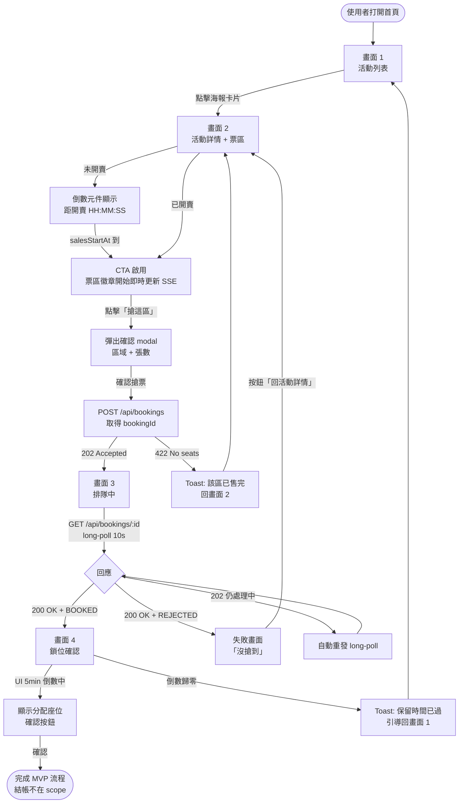

# Frontend MVP — Activity Flow

**Stage**: `/spec`
**4 個畫面的使用者流程與狀態切換**

---

## 1. 整體流程圖

---

## 2. 畫面 1：活動列表

### 進入條件
- 使用者打開 `/` 或 `/events`

### 資料來源
- `GET /api/events` → `EventResponse[]`
- （需後端新增）每個 EventResponse 含 `salesStartAt`

### 狀態
1. **載入中**：skeleton 卡片
2. **載入完成 + 有資料**：海報卡片網格，每張卡片含
   - 活動名稱、表演者、場館
   - 活動日期（eventStartTime）
   - 開賣倒數（若 salesStartAt 在未來）或「熱賣中」徽章（若已開賣）
3. **空狀態**：「目前沒有活動」插畫 + 文案
4. **錯誤**：retry 按鈕

### 互動
- 點卡片 → 導向 `/events/:id`（畫面 2）
- 搜尋框（MVP **不需要**——UI/UX decision 沒列為必要）—— **本 MVP 不做搜尋**

### 視覺重點
- Editorial grid（3-4 cols desktop），不對齊規整、海報尺寸不一可被允許
- 高對比 dark background
- 開賣倒數元件詳見 component-spec §2

---

## 3. 畫面 2：活動詳情 + 票區

### 進入條件
- URL `/events/:id`

### 資料來源
- `GET /api/events/{id}` → EventResponse（活動 meta）
- `GET /api/events/{id}/sections` → SectionAvailability[]（需後端新增）
- SSE `GET /api/events/{id}/sections/stream` → 即時 SectionStatusEvent（需後端新增）

### 狀態
1. **未開賣**（now < salesStartAt）
   - Hero：海報 + 活動資訊
   - 票區卡片：disabled，狀態徽章顯示「即將開賣」
   - 大型倒數元件（HH:MM:SS）
2. **開賣中**
   - 倒數消失，顯示「熱賣中」標記
   - 票區徽章由 SSE 即時更新（綠/黃/紅/灰）
   - 「搶這區」CTA 啟用
3. **完售**：所有票區徽章灰色，CTA 全部 disabled

### 互動
- 點擊「搶這區」→ 彈出確認 modal（區域名 + 張數 stepper 1-4）→ 確認 → POST `/api/bookings`
  - 成功（202）→ 帶 bookingId 導向 `/queue/:bookingId`（畫面 3）
  - 失敗（422）→ Toast「該區已售完」+ 該票區徽章本機立即標記灰
- 票區即時狀態：SSE 連線在進入頁面時建立，離開頁面 close

### Edge cases
- SSE 斷線：UI 顯示小型「即時連線中…」狀態指示，背後 EventSource 自動重連
- API failure on POST：保留 modal，顯示錯誤文案 + 重試
- 倒數歸零當下：fire 一次 `GET /api/events/{id}/sections` 對齊真實狀態

---

## 4. 畫面 3：排隊中

### 進入條件
- POST `/api/bookings` 收到 202 + bookingId
- 路由 `/queue/:bookingId`

### 資料來源
- `GET /api/bookings/{bookingId}` long-polling（後端 `DeferredResult`, timeout 10s）

### 狀態
1. **排隊中**（202 Accepted 持續回來，或 long-poll timeout 自動 retry）
   - 沉浸式全屏動畫（脈衝幾何 / 波紋）
   - 文案：「正在為您處理...」「預估等待時間：~10 秒」（不顯示精確位置）
   - **不**顯示「您是第 X 位」（avoid anxiety）
2. **成功**（200 OK + status=BOOKED + allocatedSeats）→ 導向 `/confirm/:bookingId`（畫面 4）
3. **失敗**（200 OK + status=REJECTED 或多次 timeout 後）→ 顯示「很抱歉，沒搶到」+ 「回活動」按鈕

### 互動
- 排隊中**不允許使用者離開**（攔截瀏覽器返回 + 提示「離開將取消請求」）
- 不顯示倒數（避免焦慮）

### Long-poll retry 策略
- 收到 202（後端 long-poll timeout 仍未完成）→ 立即重發 GET（不 sleep）
- 收到 5xx → exponential backoff（1s, 2s, 4s，最多 3 次）後顯示錯誤
- 連續 30 秒沒結果 → 顯示「處理時間較長，請稍候」副文案
- 連續 60 秒沒結果 → 顯示失敗

詳見 component-spec §4「排隊動畫」與 §5「Long-poll Hook」。

---

## 5. 畫面 4：鎖位確認（分配完成）

### 進入條件
- 收到 booking 完成的 200 OK + status=BOOKED
- 路由 `/confirm/:bookingId`

### 資料來源
- 直接使用畫面 3 傳遞過來的 `BookingResponse`（含 `allocatedSeats`），**不**再 fetch（避免 cache 問題）

### 狀態
1. **保留中**（UI 倒數 5 分鐘）
   - 大標題「已為您保留座位」
   - 座位卡片（每張票一張）：區域 / 排 / 座 / 票價
   - 大型倒數元件：MM:SS（5:00 起跳）
   - 「確認保留」CTA（MVP 點擊只顯示 demo toast「結帳流程不在本 MVP」）
2. **過期**（倒數歸零）
   - 倒數變灰、文案改「保留時間已過」
   - CTA 變為「重新搶票」→ 導向畫面 1

### 互動
- MVP 不接結帳金流，「確認」按鈕僅 demo 視覺
- 倒數來源：純前端（booking 完成 timestamp + 5min）
- 注意：MVP 後端**沒有真的釋放座位**，這是純 UX 倒數

---

## 6. 狀態管理（跨畫面）

| 狀態項 | 範圍 | 來源 |
|--------|------|------|
| `events` list | 畫面 1 cache（5min stale） | React Query |
| `event/:id` detail | 畫面 2 cache（5min stale） | React Query |
| `sections/:eventId` | 畫面 2 cache + SSE override | React Query + EventSource |
| `booking/:id` | 畫面 3 long-poll + 傳遞到畫面 4 | React Query infinite retry |
| 開賣倒數時鐘 | 全域 client tick（1Hz） | React custom hook |

---

## 7. 路由表

| Path | Screen |
|------|--------|
| `/` 或 `/events` | 畫面 1 |
| `/events/:id` | 畫面 2 |
| `/queue/:bookingId` | 畫面 3 |
| `/confirm/:bookingId` | 畫面 4 |
| `/events/:id/sold-out` | （可選）完售後的引導頁 |
