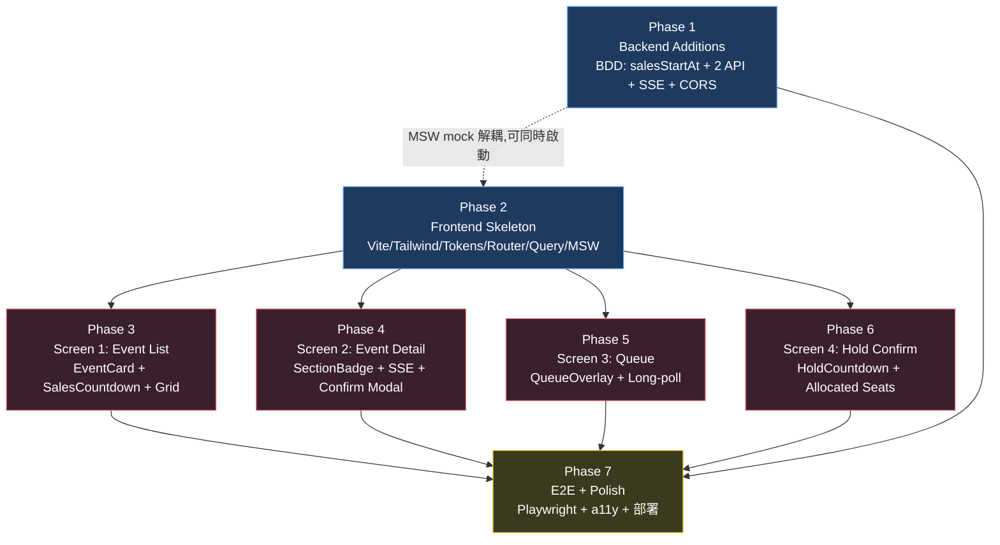

# Frontend MVP — 工程計畫（Plan）

**Stage**: `/plan`
**Date**: 2026-05-18
**Source artifacts**:
- `specs/handoffs/frontend-mvp-uiux-decision.md`
- `specs/handoffs/frontend-mvp-point-report.md`
- `specs/handoffs/frontend-mvp-spec.md`
- `specs/frontend-mvp/{README,api-contract,activity-flow,component-spec,design-tokens}.md`
- `CLAUDE.md`

---

## 1. 目標摘要

為現有 TicketMaster Java 後端（Spring Boot 4 + Kafka Streams，已通過壓測）建立 **greenfield 前端搶票 MVP**：

- **4 畫面**：活動列表 → 活動詳情 → 排隊中 → 鎖位確認
- **互動模型**：票區式搶票（後端自動分配座位，不畫場館 SVG）
- **桌面優先**，散客導向，editorial 視覺（深色 + Acid Lime accent + Inter Tight）
- **技術棧**：React 18 + TypeScript + Vite + Tailwind + TanStack Query + Framer Motion，原生 `EventSource` / `fetch`
- **後端最小延伸**：3 個 endpoint + 1 個欄位 + CORS（共約 2 工作日）
- **MVP 不做**：個別座位選擇、金流、會員、手機 RWD 細節、後台

呼應 UI/UX handoff §2 In Scope；非 scope 項目於 spec 中已收斂。

---

## 2. Dependency Graph

**圖例**：
- 藍色（P1, P2）：可同時啟動，雙線並行
- 紅色（P3-P6）：必須等 P2 完成；內部按使用者旅程順序執行（建議 P3 → P4 → P5 → P6，但若多人協作也可在 P2 完成後 4 個 Phase 平行）
- 黃色（P7）：最後集成階段，必須等 P1+P2+P3+P4+P5+P6 全部完成

---

## 3. Phase 索引表

| Phase | Title | Status | Effort | DependsOn | CanParallelWith |
|-------|-------|--------|--------|-----------|------------------|
| phase-1 | Backend Additions（BDD） | todo | M | — | phase-2 |
| phase-2 | Frontend Skeleton | todo | M | — | phase-1 |
| phase-3 | Screen 1: Event List | todo | M | phase-2 | phase-4, phase-5, phase-6（人力夠時） |
| phase-4 | Screen 2: Event Detail + SSE | todo | L | phase-2 | phase-3, phase-5, phase-6（人力夠時） |
| phase-5 | Screen 3: Queue + Long-poll | todo | M | phase-2 | phase-3, phase-4, phase-6（人力夠時） |
| phase-6 | Screen 4: Hold Confirm | todo | S | phase-2 | phase-3, phase-4, phase-5（人力夠時） |
| phase-7 | E2E + Polish + Deploy | todo | M | phase-1, phase-2, phase-3, phase-4, phase-5, phase-6 | — |

**Effort 說明**：S = 半天 / M = 1-2 天 / L = 3-5 天

---

## 4. 執行策略

### 4.1 啟動建議（Day 1）

**同時開動 phase-1（後端 RD）+ phase-2（前端 RD）**：

- phase-1 走 BDD workflow（按 `CLAUDE.md` 規範）：
  1. 在 `src/test/.../*/SectionSseSteps.java` 等寫 BDD feature 描述
  2. `/BDD-GIVEN` → `/BDD-WHEN` → `/BDD-THEN` → `/BDD-TEST_VERIFY`
  3. `/BDD-Implement` 寫 production 程式至 BDD 通過
- phase-2 用 **MSW (Mock Service Worker)** 攔截 4 個 endpoint（含 SSE mock），先把 skeleton + design tokens + 共用元件做好，**不依賴**後端
- phase-1 完成後，phase-2 切換 MSW handler 從 mock 改為 transparent，所有 phase-3 ~ phase-6 自動接到真實 API

### 4.2 中段順序（Day 3 起）

phase-2 完成後，phase-3 ~ phase-6 開始實作 4 畫面：

- **單人**：建議按使用者旅程順序 phase-3 → phase-4 → phase-5 → phase-6（前一畫面的 props/route 是下一畫面的入口）
- **多人並行**：4 個 Phase 互不依賴（除了 phase-4 的 confirm modal 需要 phase-5 的路由），可在 phase-2 完成後同時開動

每個畫面 Phase 內部走 BDD 子流程：
1. 寫畫面行為 .feature 描述（Gherkin）
2. /BDD-GIVEN 渲染元件 + mock context
3. /BDD-WHEN 模擬使用者互動（click、type、wait）
4. /BDD-THEN 驗證 DOM、API call、route transition
5. 實作元件 + page 至 BDD 通過

### 4.3 收斂期（Day 8 起）

phase-7 是全集成階段：
- Playwright E2E 跑完 4 畫面 happy path
- a11y 檢查（axe-core）
- 跨瀏覽器（Chromium / Firefox / WebKit）
- CORS / SSE 在真實 K8s nginx 反向代理下驗證（最高風險點）
- Vite build 部署設定（靜態 host / CDN）

### 4.4 卡關回滾路徑

| 卡關 | 回滾方案 |
|------|----------|
| phase-1 SSE bridge 太慢沒做完 | phase-4 暫時用 long-polling（每 10 秒一次 `/sections`）替代 SSE；不擋 demo，記入 tech debt |
| phase-1 `salesStartAt` 沒做完 | 前端 fallback「假設立即可賣」（spec api-contract §4.3 已明示） |
| Inter Tight / JetBrains Mono CJK 字重 load 慢 | preload + system-ui fallback（不擋 build） |
| Framer Motion bundle 太大 | 改用 CSS keyframes（QueueOverlay、SectionBadge pulse 不需要 JS 物理引擎） |
| Long-poll 在 nginx 被 60s timeout | phase-7 加 nginx `proxy_read_timeout 120s` config 註記 |

---

## 5. 總工時估算

以單人全職估算（假設熟悉 React + Spring Boot）：

| 情境 | phase-1 | phase-2 | phase-3 | phase-4 | phase-5 | phase-6 | phase-7 | 總計 |
|------|---------|---------|---------|---------|---------|---------|---------|------|
| 樂觀 | 1.5 day | 1.5 day | 1 day | 2 day | 1 day | 0.5 day | 1 day | **8.5 day**（並行 P1+P2 後實際 7 day） |
| 中性 | 2 day | 2 day | 1.5 day | 3 day | 1.5 day | 1 day | 1.5 day | **12.5 day**（並行後 10.5 day） |
| 悲觀 | 3 day | 3 day | 2 day | 5 day | 2 day | 1.5 day | 2.5 day | **19 day**（並行後 16 day） |

**並行加速**：P1 ‖ P2 可省 1.5-3 day；多人協作下 P3-P6 並行可再省 3-5 day。
**MVP 建議檔期**：中性 2 週、悲觀 3 週（含 buffer）。

---

## 6. Open Questions（spec 階段遺留 → build 階段需釐清）

從 `frontend-mvp-spec.md §5 Unresolved` 收斂的 3 個未答問題：

| 編號 | 問題 | 應在何時釐清 | 負責人 | 對 Plan 的影響 |
|------|------|--------------|--------|----------------|
| OQ-1 | 票價來源（`<BookingConfirmModal>` 顯示金額）：用 section 第一張 ticket 的票價代表？還是新增 `Section.basePrice`？ | phase-4 開工前 | PO + Backend RD | 若新增 `Section.basePrice` → 進入 phase-1 scope（小修改） |
| OQ-2 | 活動海報圖片來源：純色塊 / unsplash placeholder / 後端新增 `posterUrl`？ | phase-3 開工前 | PO | 純色塊不擋 build；後端新增需擴 phase-1 |
| OQ-3 | Long-poll 跨多次失敗的最終客服文案 | phase-5 收尾前 | PO / 設計 | 純文案，不擋 build |

**建議處理**：phase-1 kickoff 時把 OQ-1 一起向 PO 確認；OQ-2、OQ-3 可在對應 phase 啟動時補。

---

## 7. 給 `/build`（下一個 fresh agent）的提示

- 起點為 `/athena-carry-on-engineering-plan`，會自動讀 `plan/todo/` 並依 Dependency Graph 決定啟動順序
- **建議第一波同時啟動**：`phase-1-backend-additions` + `phase-2-frontend-skeleton`
- 後端 phase-1 走 BDD（在 `src/test/java/com/keer/ticketmaster/event` 與 `reservation` 子模組撰寫 .feature；參考 `CLAUDE.md` BDD Workflow §）
- 前端 phase-2 起就用 MSW 攔截 4 個 endpoint，確保 phase-3 ~ phase-6 隨時可獨立開發
- 每個 phase 卡片內已列 Deliverables / Acceptance Criteria，可作為 PR description 雛形
- 詳細 spec 參考鏈路：plan card → component-spec / api-contract / activity-flow → README

---

## 8. 卡片索引（plan/todo/）

| 卡片檔名 | 路徑 |
|----------|------|
| Phase 1 | `plan/todo/phase-1-backend-additions.md` |
| Phase 2 | `plan/todo/phase-2-frontend-skeleton.md` |
| Phase 3 | `plan/todo/phase-3-screen-event-list.md` |
| Phase 4 | `plan/todo/phase-4-screen-event-detail.md` |
| Phase 5 | `plan/todo/phase-5-screen-queue.md` |
| Phase 6 | `plan/todo/phase-6-screen-hold-confirm.md` |
| Phase 7 | `plan/todo/phase-7-e2e-polish.md` |

執行流程：卡片從 `todo/` 移到 `doing/`（執行中）再到 `done/`（完成）。
