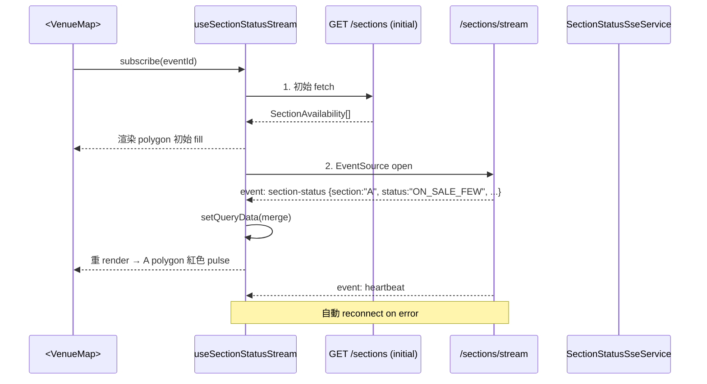

# Seat Map — Activity Flow

**Stage**: `/spec`
**Scope**: Phase A 視覺化選區流程，與既有 frontend-mvp 4 畫面流程的對照。

---

## 1. 與既有 frontend-mvp 流程的關係

Phase A **只擴充畫面 2（活動詳情）**，其他畫面與流程不動。

```
畫面 1 活動列表  ─── 不動 ──→  畫面 2 活動詳情  ─── 點某區 ──→  畫面 3 排隊中  ─── booking 完成 ──→  畫面 4 鎖位確認
                            ↑
                            ↑ Phase A 的差異只在這裡：
                            ↑ 依 event.bookingMode 切換 renderer
                            │ ├ SECTION_TEXT  → <SectionList>（既有）
                            │ ├ SECTION_VISUAL → <VenueMap>（Phase A 新增）
                            │ └ SEAT_LEVEL    → <SeatLevelPlaceholder>（Phase B 預留）
```

→ 路由表、long-poll、SSE、modal、確認頁 **全部沿用 frontend-mvp**。

---

## 2. Phase A 完整流程圖（含 mode switching）

```mermaid
flowchart TD
    Start([使用者進入 /events/:id]) --> Fetch[並行 fetch:<br/>GET /events/:id<br/>GET /venues/:venueId<br/>GET /events/:id/sections]
    Fetch --> Mode{event.bookingMode}

    Mode -->|undefined / SECTION_TEXT| TxtRender[渲染 SectionList<br/>沿用既有 SectionBadge grid]
    Mode -->|SECTION_VISUAL| Parse[parseVenueSeatMap<br/>venue.seatMap]
    Mode -->|SEAT_LEVEL| PhB[渲染 SeatLevelPlaceholder<br/>「敬請期待」]

    Parse -->|valid JSON & schemaVersion=1| VizRender[渲染 VenueMap<br/>SVG + polygon × sections]
    Parse -->|invalid / null| Fallback[降級為 SectionList<br/>+ log warning]

    TxtRender --> SubscribeSSE[useSectionStatusStream<br/>訂閱 /sections/stream]
    VizRender --> SubscribeSSE
    Fallback --> SubscribeSSE

    SubscribeSSE --> Live[徽章 / polygon 即時染色<br/>依 status: PLENTY/LIMITED/FEW/SOLD_OUT]

    Live -->|使用者點某 section<br/>polygon 或 badge| ModalOpen[開啟 BookingConfirmModal<br/>與既有完全相同]
    ModalOpen -->|確認搶票| POST[POST /api/bookings<br/>既有路徑]
    POST -->|202 + bookingId| Queue[/queue/:bookingId<br/>沿用畫面 3]
    POST -->|422 No seats| ToastSold[Toast「該區已售完」<br/>polygon 立即染灰]
    ToastSold --> Live
    Queue --> Confirm[/confirm/:bookingId<br/>沿用畫面 4]
    Confirm --> Done([完成])

    PhB --> NoOp([停留在畫面 2<br/>不進入搶票])
```

---

## 3. 視覺化選區（`SECTION_VISUAL`）關鍵狀態

### 3.1 進入頁面初始狀態

| 子狀態 | 顯示 | 來源 |
|--------|------|------|
| 並行 fetch loading | hero skeleton + 場館圖 skeleton（灰底矩形） | React Query `isLoading` |
| 場館圖載入完成、sections 載入中 | polygon 已畫出但全部 NOT_STARTED 灰色 | venue.seatMap 已 parse、sections 還沒回 |
| 全部載入完成、未開賣 | polygon 全部 NOT_STARTED 灰色 + 上方 `<SalesCountdown>` hero size | event.salesStartAt > now |
| 開賣中 | polygon 依 SSE 染色（綠 / 黃 / 紅 / 灰） | SectionStatusEvent |
| 全部售完 | polygon 全部灰色 + 「本場已售完」帶狀 | allSoldOut |

### 3.2 polygon 互動狀態（單一 section 視角）

| 狀態 | fill | stroke | cursor | onClick |
|------|------|--------|--------|---------|
| NOT_STARTED | `--bg-surface-2` 半透明 | `--line-subtle` | not-allowed | disabled |
| ON_SALE_PLENTY | `--status-plenty` 30% alpha | `--status-plenty` | pointer | open modal |
| ON_SALE_LIMITED | `--status-limited` 30% alpha | `--status-limited` | pointer | open modal |
| ON_SALE_FEW | `--status-few` 30% alpha + **pulse 1.6s** | `--status-few` | pointer | open modal |
| SOLD_OUT | `--bg-surface-2` 線稿 | `--line-subtle` dashed | not-allowed | disabled |
| hover（可選狀態時） | fill alpha 提到 50% | stroke-width 2px | pointer | — |
| focus（鍵盤） | accent ring 2px | — | — | Enter triggers modal |

→ 詳細視覺規格見 `component-spec.md`。

---

## 4. 與 SSE 的整合



→ `<VenueMap>` **不引入新的 SSE 通道**。直接消費 frontend-mvp 已建立的 `useSectionStatusStream` hook、React Query cache key (`sectionsKeys.byEvent`)。

---

## 5. 「視覺化選區」與「文字票區」對比表

| 環節 | `SECTION_TEXT` | `SECTION_VISUAL`（Phase A） |
|------|---------------|---------------------------|
| Renderer | `<SectionList>` grid of `<SectionBadge>` | `<VenueMap>` SVG with `<polygon>` per section |
| 點擊區域 | 矩形徽章 | polygon / rect / circle |
| 狀態顯示 | 徽章邊框色 + 文字標籤 | polygon fill 顏色 + 可選文字 label |
| 場館視覺 | 無 —— 只有票區清單 | 完整場館布局 + 舞台位置 |
| 確認 modal | 共用 `<BookingConfirmModal>` | 共用 `<BookingConfirmModal>` |
| 後續流程 | 排隊 → 鎖位確認 | 排隊 → 鎖位確認（**完全相同**） |
| SSE | 訂閱 `/sections/stream` | 訂閱 `/sections/stream`（**同一個**） |
| Long-poll | `useBookingPoll` | `useBookingPoll`（**同一個**） |

→ **使用者只是 visual representation 不同；商業流程 100% 相同**。

---

## 6. Edge Case / Failure Path

### 6.1 場館圖 JSON 缺失或損毀

```
event.bookingMode === 'SECTION_VISUAL'
+ parseVenueSeatMap(venue.seatMap) === null
↓
renderer 降級為 <SectionList>（與 SECTION_TEXT 一致）
+ 開發環境 console.warn
```

→ **使用者體驗不中斷**，只是退回文字模式。

### 6.2 SSE 斷線

沿用 frontend-mvp 既有規則：
- 瀏覽器 `EventSource` 自動 reconnect
- 重連成功後 fire 一次 `GET /sections` 拿初始狀態
- UI 顯示「重新連線中…」chip（在 hero 右上角）

→ `<VenueMap>` 不需額外處理，邏輯在 hook 內。

### 6.3 點擊 polygon 但搶票 race lost

```
使用者點 A 區 → modal 確認 → POST /bookings
↓
後端 422（Redis 預檢敗）
↓
Toast「該區已售完」+ A polygon 立即染灰
+ modal 關閉
+ 使用者可繼續點其他 polygon
```

→ 與 `SECTION_TEXT` 行為完全一致，沿用既有 `handleConfirmBooking` 邏輯。

### 6.4 場館圖 polygon name 與後端 sections 不匹配

```
venue.seatMap.sections = ["A", "B", "C", "D", "E", "F"]
但 GET /sections = ["A", "B", "C", "D", "E"]
↓
F polygon 顯示為灰色 + cursor not-allowed + tooltip "未配置"
A-E polygons 正常運作
```

→ 不擋整張圖；只標記未配置區。

---

## 7. 路由表（不變）

| Path | Screen | Phase A 變動 |
|------|--------|-------------|
| `/` 或 `/events` | 畫面 1 | 不動 |
| `/events/:id` | 畫面 2（含 mode switch） | **本次唯一改動點** |
| `/queue/:bookingId` | 畫面 3 | 不動 |
| `/confirm/:bookingId` | 畫面 4 | 不動 |

→ Phase A 不新增任何路由。
